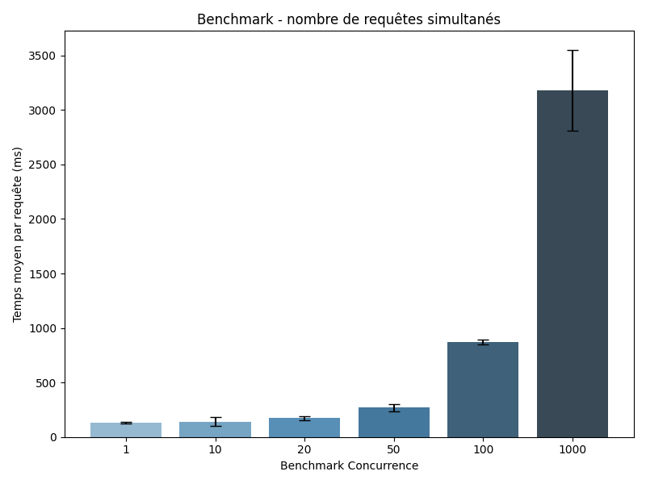
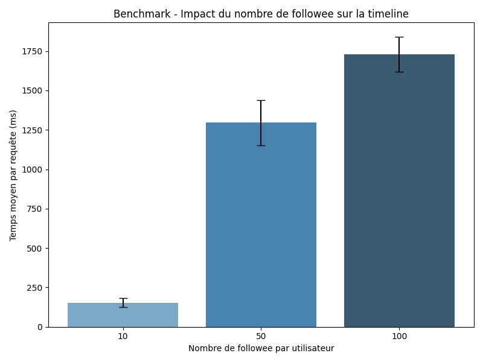

# DataMassiveProject

_Pour chacune des étapes qui vont suivre, les données ont été saisies à la main dans le fichier CSV après avoir obtenu les résultats avec Locust._

## **Passage à l'échelle sur la charge :**


### Génération des données :
Peuplement du Datastore avec 1000 utilisateurs, 50 posts par utilisateur et 20 followees :

```bash
python seed.py --users 1000 --posts 50000 --follows-min 20 --follows-max 20
```

### Benchmark des performances :
Script Python pour lancer locust et pouvoir éxécuter tout les tests sur le site :

```bash
from locust import HttpUser, task, between
import random

TOTAL_USERS = 1000

class TimelineUser(HttpUser):
    wait_time = between(0.1, 0.5)

    def on_start(self):
        # Chaque utilisateur Locust aura un user différent
        self.user_id = random.randint(1, TOTAL_USERS)

    @task
    def get_timeline(self):
        self.client.get(f"/api/timeline?user=user{self.user_id}")
```

### Plot des résultats :
Script Python pour générer les barplot :

```bash
import pandas as pd
import matplotlib.pyplot as plt
import seaborn as sns

# Lire le CSV
df = pd.read_csv("conc.csv")

# Nettoyer AVG_TIME
df['AVG_TIME'] = df['AVG_TIME'].astype(str).str.replace('ms','').astype(float)

# Calculer la moyenne par param
summary = df.groupby('PARAM')['AVG_TIME'].mean().reset_index()

# Ajouter les écarts-types (calculés à la main)
summary['STD'] = [3.90, 66.77, 82.77, 49.64, 102.78, 0]

# Créer le plot avec Seaborn et ajouter les barres d'erreur
plt.figure(figsize=(8,6))
ax = sns.barplot(x='PARAM', y='AVG_TIME', data=summary, palette='Blues_d')
ax.errorbar(x=range(len(summary)), y=summary['AVG_TIME'], yerr=summary['STD'], fmt='none', c='black', capsize=5)

plt.xlabel('Nombre de requêtes simultanées')
plt.ylabel('Temps moyen par requête (ms)')
plt.title('Benchmark concurrence - TinyInsta')
plt.tight_layout()
plt.savefig("conc.png")
plt.show()
```

### **Résultat pour le premier exercice :** 


---

## **Passage à l'échelle sur taille des données :**

### Post :

Peuplement du Datastore avec 100 utilisateurs, 10,100,1000 posts par utilisateur et 20 followees :

```bash
python seed.py --users 100 --posts 1000/10000/100000 --follows-min 20 --follows-max 20
```

Les programmes utilisés sont les mêmes :


---

### Followee :

Peuplement du Datastore avec 11, 51, 101 utilisateurs 100 posts par utilisateur et 10, 50, 100 followees :

```bash
python3 seed.py --users 11/51/101 --posts 1110/5100/10100 --follows-min 10/50/100 --follows-max 10/50/100
```

Les programmes utilisés sont les mêmes :



